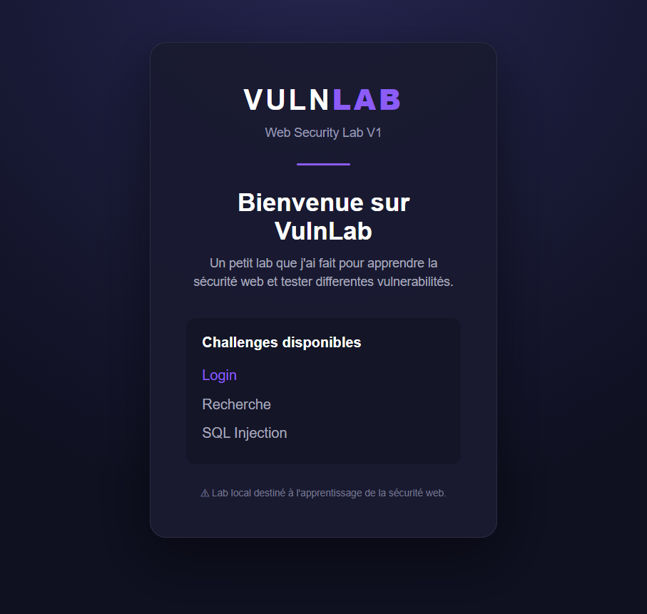

# VulnLab

VulnLab est un petit projet que je développe pour apprendre la cybersécurité et la sécurité web.

Le but est de créer une application web volontairement vulnérable et d'y ajouter différents challenges, un peu dans l'idée d'un mini CTF.

## Aperçu

## Pour le moment

- Page d'accueil
- Page de connexion
- Base SQLite
- SQL Injection
- Système de flags

Le fichier `styles.css` a été réalisé avec l'aide d'une IA. Tout le reste a été fait à la main.
